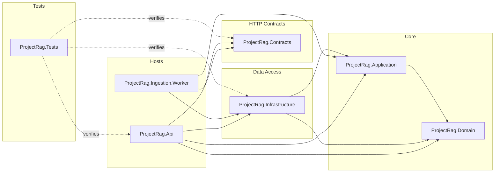
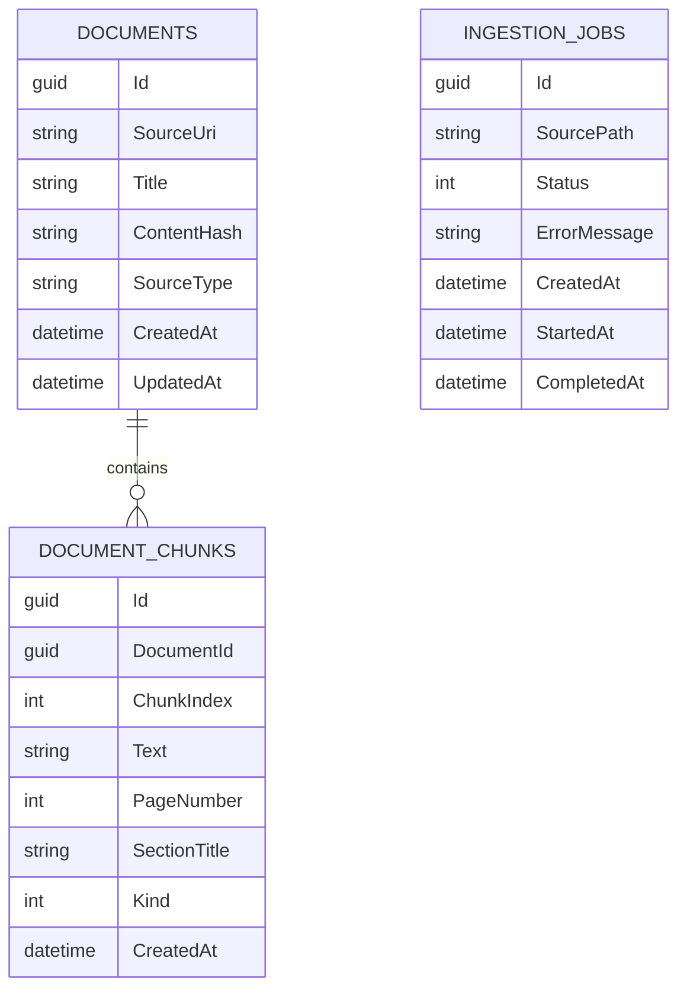
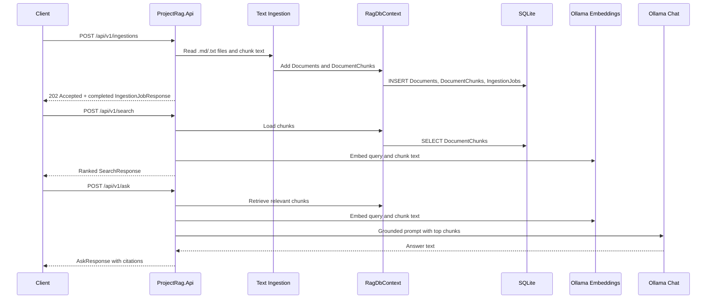

# Architecture

ProjectRag is a layered .NET RAG service. The architecture is intentionally conservative: establish clear boundaries, persistence, API contracts, testability, and a simple RAG loop before introducing scanned PDFs, hybrid retrieval, reranking, or agentic orchestration.

## Layers

```text
ProjectRag.Api
  Minimal API endpoints
  Composition root
  OpenAPI setup

ProjectRag.Contracts
  Request and response DTOs
  HTTP boundary models

ProjectRag.Domain
  Persistent domain entities
  Domain enums

ProjectRag.Infrastructure
  EF Core DbContext
  SQLite provider registration
  Entity configurations
  Migrations
  Text ingestion
  Ollama AI client registration
  In-memory cosine vector search

ProjectRag.Application
  Future orchestration/services

ProjectRag.Ingestion.Worker
  Future background ingestion processing

ProjectRag.Tests
  Integration and unit tests
```

## Dependency Direction

The current dependency shape is:

```text
Api -> Contracts
Api -> Infrastructure
Infrastructure -> Domain
Infrastructure -> Application
Application -> Domain
Tests -> Api, Contracts, Infrastructure
```

The domain project should stay independent. It should not reference EF Core, ASP.NET Core, Infrastructure, or API.



## Persistence Model

The persistence layer stores three main concepts:

- `Document`: one original source document.
- `DocumentChunk`: one searchable text chunk belonging to a document.
- `IngestionJob`: status record for document ingestion work.

Current EF Core tables:

```text
Documents
DocumentChunks
IngestionJobs
```

`DocumentChunk` has a required relationship to `Document` and cascades on document deletion. `IngestionJob` is independent for now.



## EF Core Configuration

EF mapping is configured with Fluent API classes in Infrastructure:

```text
ProjectRag.Infrastructure/Configurations/Persistence
```

`RagDbContext` applies these configurations through:

```csharp
modelBuilder.ApplyConfigurationsFromAssembly(typeof(RagDbContext).Assembly);
```

This keeps persistence mapping out of domain entities.

## RAG Flow

Implemented behavior:

- `POST /api/v1/ingestions` ingests `.md` and `.txt` files from a local path.
- `GET /api/v1/ingestions/{id}` returns a persisted ingestion job.
- `GET /api/v1/documents` reads documents from SQLite.
- `POST /api/v1/search` embeds the query, scores stored chunks with cosine similarity, and returns ranked hits.
- `POST /api/v1/ask` retrieves top chunks, builds a grounded prompt, calls the chat model, and returns an answer with citations.

The current vector search is intentionally simple: embeddings are generated with Ollama and held only in memory during the request. Chunk embeddings are recomputed on each search. Persistent vector storage is deferred until a later phase.



## Testing Strategy

Current integration tests use:

- `WebApplicationFactory<Program>`
- SQLite in-memory database
- DI replacement of `RagDbContext`
- fake embedding generator
- fake chat client

This verifies API + DI + EF Core + retrieval/answer behavior without mutating the developer's local SQLite file and without requiring Ollama during tests.

## Current Limitations

- Ingestion runs inline in the API request.
- Only `.md` and `.txt` files are supported.
- Chunking is paragraph/character based, not semantic or token based.
- Chunk embeddings are recomputed on each search.
- Vector search is in-memory cosine scoring, not a persistent vector database.
- `/ask` is grounded by prompt instruction and citations, but claim-level citation validation is not implemented.
- Hybrid retrieval, query rewriting, RRF fusion, reranking, scanned PDFs, and agentic behavior are later phases.
