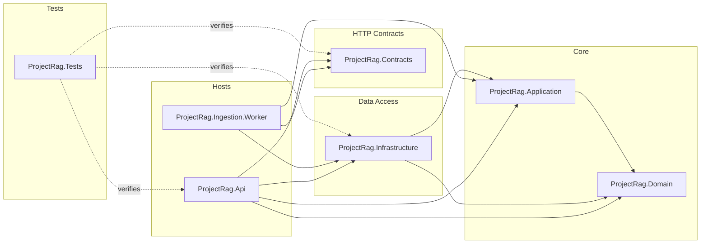
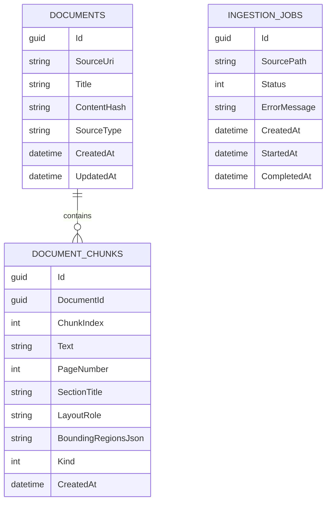
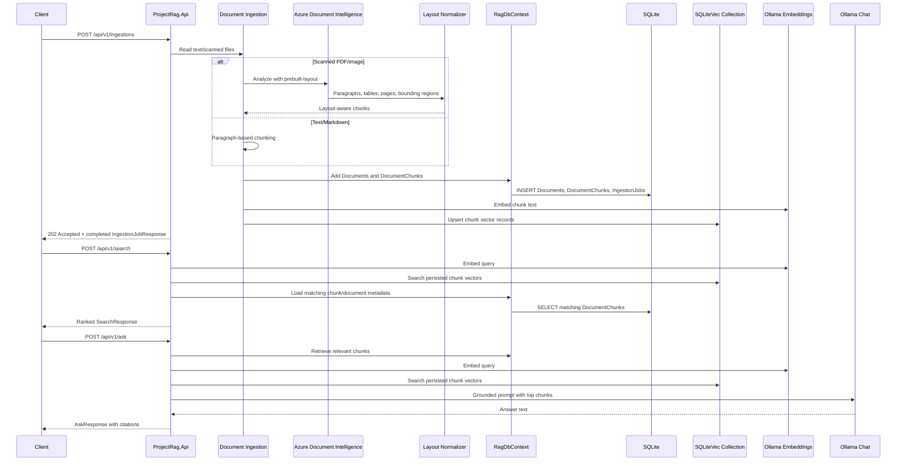

# Architecture

ProjectRag is a layered .NET RAG service. The architecture is intentionally conservative: establish clear boundaries, persistence, API contracts, testability, scanned document extraction, a simple RAG loop, and local persistent vector storage before introducing hybrid retrieval, reranking, or agentic orchestration.

## Layers

```text
ProjectRag.Api
  Minimal API endpoints
  Composition root
  OpenAPI setup

ProjectRag.Contracts
  Request and response DTOs
  HTTP boundary models

ProjectRag.Domain
  Persistent domain entities
  Domain enums

ProjectRag.Infrastructure
  EF Core DbContext
  SQLite provider registration
  MEVD SQLiteVec vector collection
  Entity configurations
  Migrations
  Text ingestion
  Azure AI Document Intelligence extraction
  Layout-aware chunk normalization
  Ollama AI client registration
  Persistent vector indexing and search

ProjectRag.Application
  Application abstractions and cross-layer models

ProjectRag.Ingestion.Worker
  Future background ingestion processing

ProjectRag.Tests
  Integration and unit tests
```

## Dependency Direction

The current dependency shape is:

```text
Api -> Contracts
Api -> Infrastructure
Infrastructure -> Domain
Infrastructure -> Application
Application -> Domain
Tests -> Api, Contracts, Infrastructure
```

The domain project should stay independent. It should not reference EF Core, ASP.NET Core, Infrastructure, or API.

## Type Visibility

Keep the public surface area small:

- Infrastructure concrete services/configurations/options: `internal`.
- Infrastructure DI entry point and `RagDbContext`: `public`.
- Application abstractions/models: `public`.
- Domain entities/enums: `public`.
- Contract request/response DTOs: `public`.
- API endpoint mapping classes: `internal`.
- `Program`: `public partial` so integration tests can use `WebApplicationFactory<Program>`.



## Persistence Model

The persistence layer stores EF Core metadata plus a local vector collection:

- `Document`: one original source document.
- `DocumentChunk`: one searchable text chunk belonging to a document.
- `IngestionJob`: status record for document ingestion work.
- `document_chunks`: MEVD SQLiteVec vector collection keyed by chunk id.

Current EF Core tables:

```text
Documents
DocumentChunks
IngestionJobs
```

`DocumentChunk` has a required relationship to `Document` and cascades on document deletion. `IngestionJob` is independent for now. Vector records are stored through MEVD SQLiteVec in the same local SQLite database file but are managed outside EF Core migrations.



## EF Core Configuration

EF mapping is configured with Fluent API classes in Infrastructure:

```text
ProjectRag.Infrastructure/Configurations/Persistence
```

`RagDbContext` applies these configurations through:

```csharp
modelBuilder.ApplyConfigurationsFromAssembly(typeof(RagDbContext).Assembly);
```

This keeps persistence mapping out of domain entities.

## RAG Flow

Implemented behavior:

- `POST /api/v1/ingestions` ingests `.md`, `.txt`, PDF, and common image files from a local path.
- `GET /api/v1/ingestions/{id}` returns a persisted ingestion job.
- `GET /api/v1/documents` reads documents from SQLite.
- `POST /api/v1/search` embeds the query, searches the MEVD SQLiteVec collection, loads matching chunk metadata from EF Core, and returns ranked hits.
- `POST /api/v1/ask` retrieves top chunks, builds a grounded prompt, calls the chat model, and returns an answer with citations.

Chunk embeddings are generated once during ingestion and persisted in a local SQLiteVec collection. Search embeds only the query, uses the vector collection for nearest-neighbor retrieval, and joins results back to EF Core metadata for citations.

Text and markdown files use paragraph-based fixed-size chunking. Scanned documents use Azure AI Document Intelligence `prebuilt-layout`, then a layout-aware rule-based chunking strategy:

- Sort extracted layout blocks by document span.
- Use headings as section boundaries.
- Keep tables as separate Markdown table chunks.
- Merge nearby paragraph fragments under the current heading.
- Preserve page number, section title, layout role, and bounding regions on chunks.



## Testing Strategy

Current integration tests use:

- `WebApplicationFactory<Program>`
- SQLite in-memory database
- DI replacement of `RagDbContext`
- fake embedding generator
- fake chat client
- fake document extractor
- direct tests for layout block normalization
- file-backed SQLite tests for MEVD SQLiteVec vector search

This verifies API + DI + EF Core + extraction/ingestion + retrieval/answer behavior without mutating the developer's local SQLite file and without requiring Ollama or Azure during tests.

## Current Limitations

- Ingestion runs inline in the API request.
- Chunking is paragraph/layout based, not semantic, recursive, token based, or overlapping.
- SQLiteVec is currently a preview connector, so package versions must stay aligned with its expected `Microsoft.Extensions.VectorData.Abstractions` version.
- Changed-file reingestion has a skipped regression test pending a focused EF tracking design pass.
- `/ask` is grounded by prompt instruction and citations, but claim-level citation validation is not implemented.
- Hybrid retrieval, query rewriting, RRF fusion, reranking, and agentic behavior are later phases.
