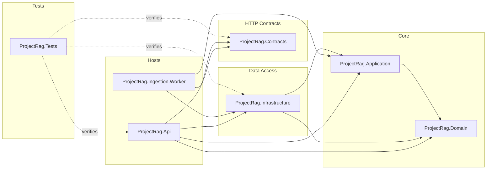
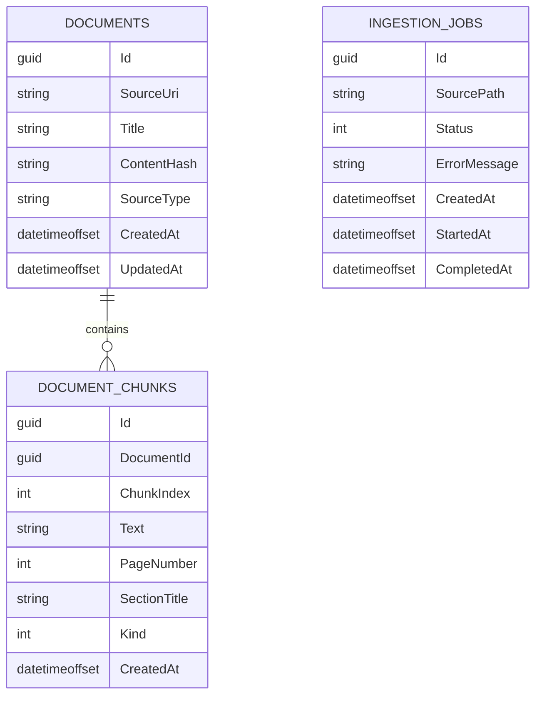
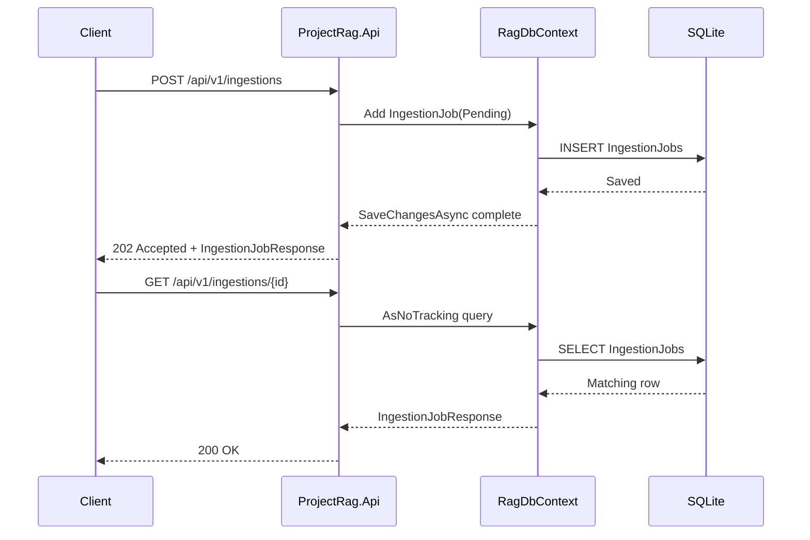

# Architecture

ProjectRag is a layered .NET RAG service. The architecture is intentionally conservative in Phase 0: establish clear boundaries, persistence, API contracts, and testability before introducing embeddings, LLMs, vector stores, or retrieval orchestration.

## Layers

```text
ProjectRag.Api
  Minimal API endpoints
  Composition root
  OpenAPI setup

ProjectRag.Contracts
  Request and response DTOs
  HTTP boundary models

ProjectRag.Domain
  Persistent domain entities
  Domain enums

ProjectRag.Infrastructure
  EF Core DbContext
  SQLite provider registration
  Entity configurations
  Migrations

ProjectRag.Application
  Future orchestration/services

ProjectRag.Ingestion.Worker
  Future background ingestion processing

ProjectRag.Tests
  Integration and unit tests
```

## Dependency Direction

The current dependency shape is:

```text
Api -> Contracts
Api -> Infrastructure
Infrastructure -> Domain
Infrastructure -> Application
Application -> Domain
Tests -> Api, Contracts, Infrastructure
```

The domain project should stay independent. It should not reference EF Core, ASP.NET Core, Infrastructure, or API.



## Persistence Model

Phase 0 stores three main concepts:

- `Document`: one original source document.
- `DocumentChunk`: one searchable text chunk belonging to a document.
- `IngestionJob`: status record for document ingestion work.

Current EF Core tables:

```text
Documents
DocumentChunks
IngestionJobs
```

`DocumentChunk` has a required relationship to `Document` and cascades on document deletion. `IngestionJob` is independent for now.



## EF Core Configuration

EF mapping is configured with Fluent API classes in Infrastructure:

```text
ProjectRag.Infrastructure/Configurations/Persistence
```

`RagDbContext` applies these configurations through:

```csharp
modelBuilder.ApplyConfigurationsFromAssembly(typeof(RagDbContext).Assembly);
```

This keeps persistence mapping out of domain entities.

## API Behavior

Implemented Phase 0 behavior:

- `POST /api/v1/ingestions` creates a pending ingestion job.
- `GET /api/v1/ingestions/{id}` returns a persisted ingestion job.
- `GET /api/v1/documents` reads documents from SQLite.
- `POST /api/v1/search` is a placeholder.
- `POST /api/v1/ask` is a placeholder.

Phase 1 should implement the first naive RAG loop behind `/search` and `/ask`.



## Testing Strategy

Current integration tests use:

- `WebApplicationFactory<Program>`
- SQLite in-memory database
- DI replacement of `RagDbContext`

This verifies API + DI + EF Core behavior without mutating the developer's local SQLite file.

## Phase 1 Direction

Phase 1 should add naive RAG over local text or markdown files:

```text
question -> embed question -> vector search -> prompt with top chunks -> answer
```

Recommended additions:

- sample text/markdown documents
- simple ingestion command or endpoint
- in-memory vector store
- embedding abstraction
- search result model
- answer response with citations

Do not add hybrid search, query rewriting, reranking, or agent planning until later phases.
